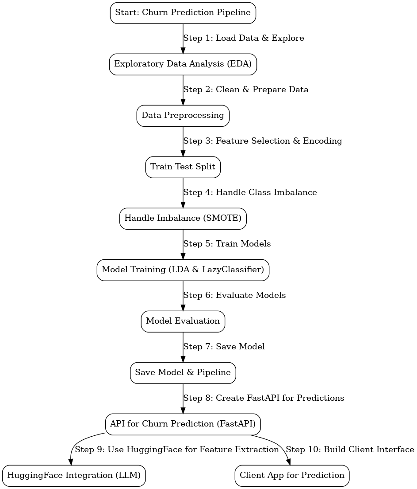

  

  

# Churn Prediction System

  

  

## Overview

  

This project showcases a machine learning churn prediction system integrated with a chatbot interface powered by a Large Language Model (LLM). It allows the marketing team to interact with the churn prediction model via natural language queries using FastAPI. The model predicts customer churn based on several features extracted from customer data.

  

  

## Features

  

-  **Churn Prediction Model**: Predicts whether a customer will churn using a machine learning model (Linear Discriminant Analysis).

  

-  **API Integration**: Provides a FastAPI-based API for submitting customer data and receiving churn predictions.

  

-  **LLM-powered Chatbot**: Utilizes a Hugging Face LLM to translate natural language queries from the marketing team into structured data for churn prediction.

  

  

## Architecture Diagram

  



  

  

## Documentation

  

  

### a. Technical and Business Motivations:

  

The solution design is driven by the need to create a seamless and intuitive experience for the marketing team to interact with a machine learning model for churn prediction. Here's a breakdown of the motivations:

  

  

-  **Large Language Model (LLM) Integration**:

  

The primary goal of using an LLM is to translate natural language queries from the marketing team into structured data that can be processed by the churn prediction model. This bridges the gap between technical data requirements and business-oriented questions. Hugging Face’s LLM platform was selected to ensure smooth, reliable, and state-of-the-art natural language processing.

  

  

-  **Machine Learning Model for Churn Prediction**:

  

The chosen Linear Discriminant Analysis (LDA) model is a classical machine learning algorithm well-suited for binary classification problems like churn prediction. LDA has the advantage of simplicity and interpretability, which is critical for making predictions understandable for the business team. Additionally, class imbalance was handled using SMOTE to ensure that churn (a minority class) is predicted more accurately.

  

  

-  **API Pipeline**:

  

The FastAPI framework is used to deploy the model as an API. This allows the marketing team to interact with the churn prediction system through the LLM-powered chatbot. FastAPI provides speed, simplicity, and asynchronous capabilities, making it ideal for this Proof of Concept (PoC).

  

  

### b. How the Solution Aligns with the Client's Requirements:

  

The architecture and workflow implemented align well with the client’s specific goals:

  

  

-  **End-to-End Model Interaction**: The marketing team can interact with the system without needing to understand the underlying machine learning mechanics. They ask questions about customer churn using natural language, and the chatbot translates these into structured inputs for the model, thereby reducing the complexity and making the system user-friendly.

  

  

-  **Open-Source Models**: By leveraging open-source LLM models through Hugging Face, the solution adheres to the client’s request of avoiding third-party LLMs that are not open source. This not only ensures transparency but also allows for future customizations.

  

  

-  **Comprehensive Documentation and Pipeline**: The API and chatbot pipeline allow for flexible integration with other systems, ensuring that marketing team members can easily access churn predictions. Comprehensive documentation on how to use the API and chatbot ensures smooth handoff and usability.

  

  

## Project Structure

  

```bash 
churn-prediction-project/
├──  app.py  # FastAPI app to serve the churn prediction model
├──  model.pkl  # Trained model file 
├──  model_pipeline.pkl  # Model pipeline for preprocessing + prediction
├──  Modeling.ipynb  # Jupyter notebook for model development and exploration
├──  README.md  # Documentation file 
├──  requirements.txt  # List of dependencies required to run the project
└──  diagrams/  # Folder containing diagrams
	└──  churn_prediction_system_styled.png  # Architecture diagram
	└──  ScreenShoot.png  # ScreenShoot of testing the chatbot
```

  

  

## Setup Instructions

  

  

1.  **Clone the repository**:

  

```bash
git  clone  https://github.com/yourusername/churn-prediction-project.git

cd  churn-prediction-project
```

  

  

2.  **Install dependencies**:

  

```bash
pip  install  -r  requirements.txt
```

  

  

3.  **Run the API**:

  

Start the FastAPI server:

  

```bash
uvicorn  app:app  --reload
```

  

  

4.  **Interact with the API**:

  

Use tools like Postman or cURL to send POST requests to `http://localhost:8000/predict` with the required customer data.

  

  

## How to Use

  
  

Once the FastAPI server is running, you can interact with the API to predict customer churn. The API accepts a POST request containing the customer's details in a JSON format.

####  Important:
#####  Before running the API, you need to ensure that you have access to Meta's Llama 3 models on Hugging Face. Follow these steps:
- Verify Access to Meta's Llama 3 Models: Go to the Hugging Face website, Navigate to the Meta Llama 3 models and request access if needed, Once you have access, generate an Access Token from your Hugging Face account settings, Replace the Access Token in the Code That's how to do it :
-- open the app.py file in the repository.
-- Replace the token part in the code with your personal Hugging Face access token.

  

Here’s how you can use the API:

  

  

1.  **Run the FastAPI server** using:

  

```bash
uvicorn  app:app  --reload 
```

  

  

2.  **Send a POST request** to the API endpoint `/predict` with the customer’s details.

  

  

-  **Endpoint**: `http://localhost:8000/predict`

  

-  **Method**: POST

  

-  **Content-Type**: application/json

  

  

3.  **Input**: Send the customer information (in natural language) as a JSON payload. Example:

  

```json
{
"customer_information": "The customer is a male who is not a senior citizen. He has been with the company for 45 months. The customer is not married and has no dependents. He does not have phone service but uses a dual-line connection. His internet service provider is DSL. The customer has online security enabled, does not have online backup, but has device protection. He receives technical support but does not subscribe to streaming TV or streaming movies. The customer has a one-year contract and does not use paperless billing. He pays through bank transfer (automatic). His monthly charges are 42.3 and his total charges so far are 1840.75."
}
```

  

  

## Example

  

  

After sending the POST request, the API will return whether the customer is likely to churn or not.


  

### Example Request:

  

```bash
curl  -X  POST  "http://localhost:8000/predict"  -H  "Content-Type: application/json"  -d  '{


"customer_information": "The customer is a male who is not a senior citizen. He has been with the company for 45 months. The customer is not married and has no dependents. He does not have phone service but uses a dual-line connection. His internet service provider is DSL. The customer has online security enabled, does not have online backup, but has device protection. He receives technical support but does not subscribe to streaming TV or streaming movies. The customer has a one-year contract and does not use paperless billing. He pays through bank transfer (automatic). His monthly charges are 42.3 and his total charges so far are 1840.75."
}'
```

  

  

### Example Response:

  

```json
{
"Churn Prediction": "No"
}
```

  

  

This response indicates that the customer is not likely to churn.
